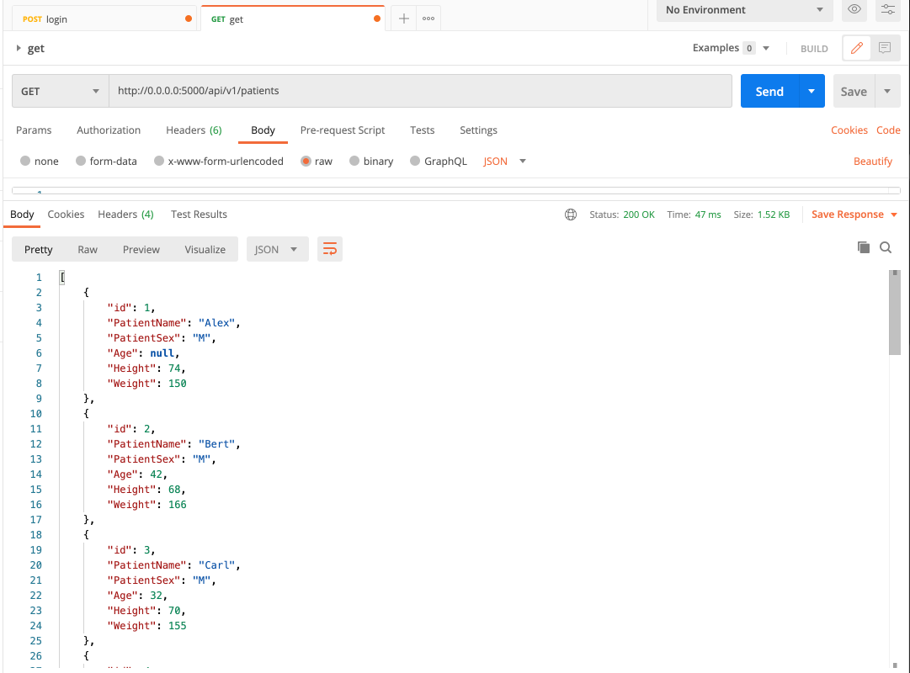
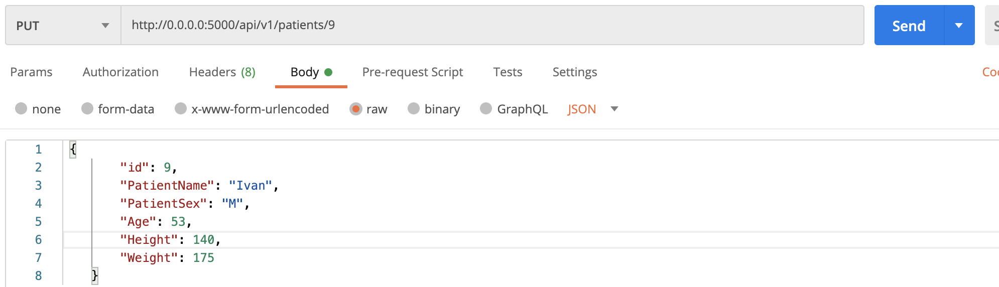
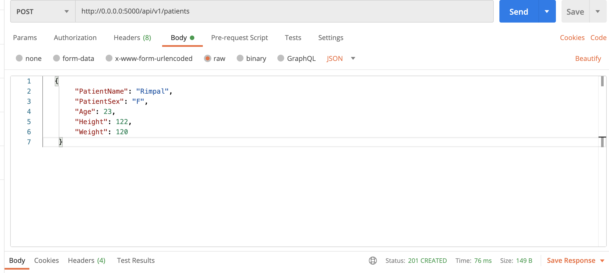
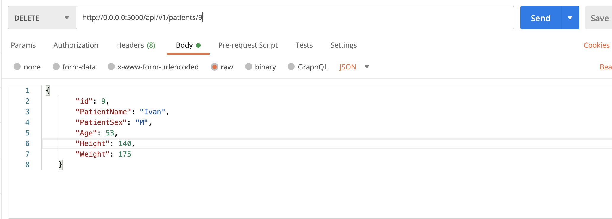

# Webforms with Flask, Docker, and MySQL

In this project we will create HTML forms to create new records, update records, and form that performs CRUD operations.

Please find the word file of screenshots to be submitted [here](Lesson3IS601.docx).

[Word file for Individual Project: web application Part / final](IS601FinalPart_RIMPAL.docx)

# Screenshots of working REST API
(The word file includes all the required screenshots)

1. Request: **GET**

2. Request: **PUT**

3. Request: **POST**

4. Request: **DELETE**

